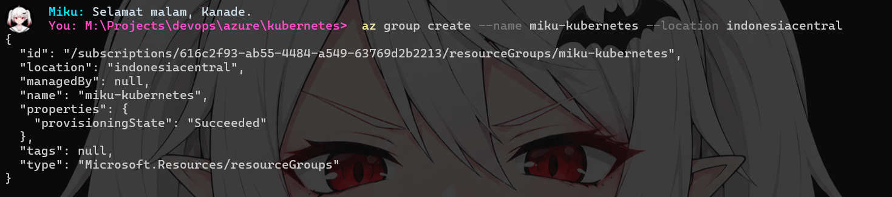
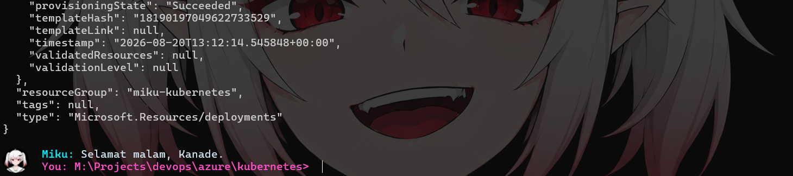
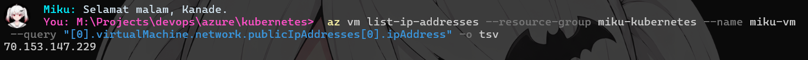
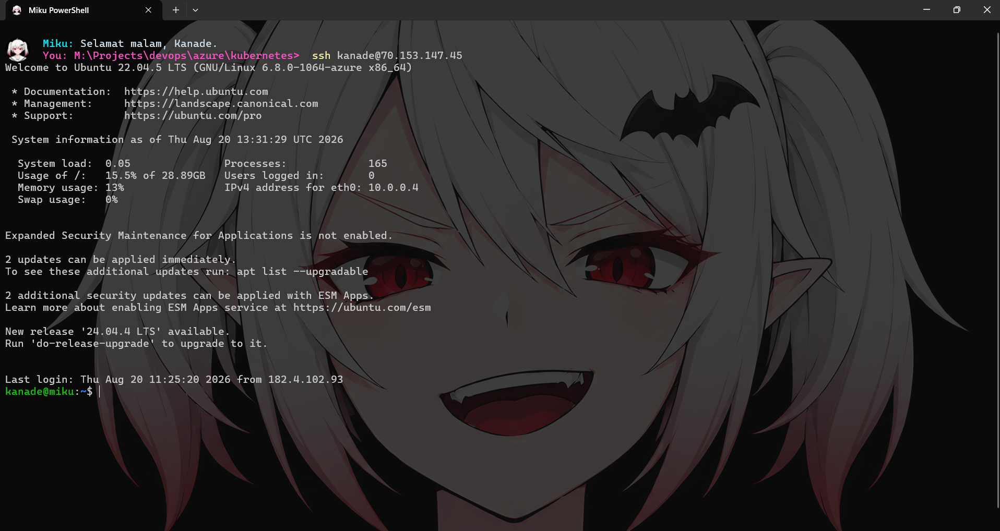
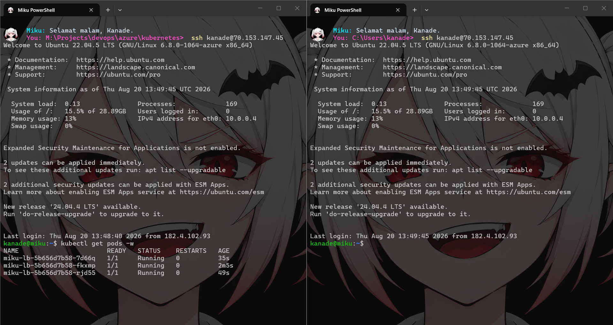
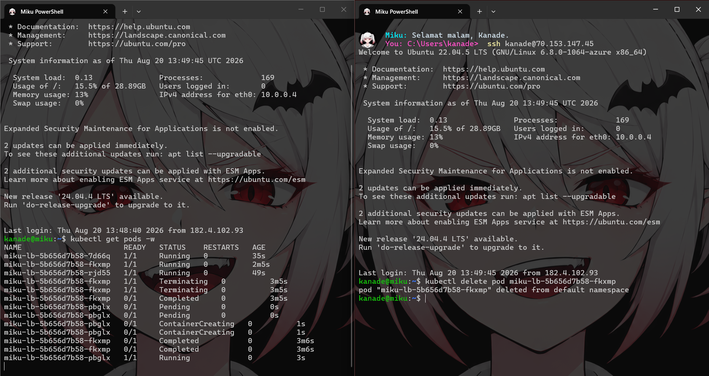
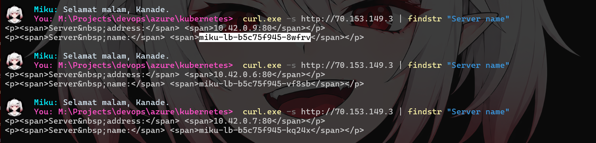

<div align="center">

# Lightweight Kubernetes (K3s)

<p>Otomatisasi deployment cluster K3s di Azure VM menggunakan Bicep IaC (Infrastructure as Code)</p>

[](https://kubernetes.io)
[](https://k3s.io)
[](https://azure.microsoft.com)
[](https://learn.microsoft.com/azure/azure-resource-manager/bicep/)

</div>

### Memulai
```
winget install Microsoft.AzureCLI
az --version
az login
```

Sesuaikan `param` pada [kubernetes.bicep](./kubernetes.bicep) dan [main.bicep](./main.bicep).

### Create Resource Group (RG)
```ps1
az group create --name <Nama RG> --location indonesiacentral
```

- Sesuaikan `<Nama RG>` dengan nama Resource Group yang diinginkan.
- Sesuaikan `indonesiacentral` pada `--location` dengan lokasi yang diinginkan.

### Deploy Kubernetes Cluster (K3s)
```ps1
az deployment group create --resource-group <Nama RG> --template-file main.bicep --parameters location='indonesiacentral' adminPassword='password'
```

- Sesuaikan `<Nama RG>` dengan nama Resource Group yang telah dibuat sebelumnya.
- Sesuaikan `indonesiacentral` pada `location` dengan lokasi yang diinginkan.
- Sesuaikan `password` pada `adminPassword` dengan password yang diinginkan.

### Pengujian
Periksa IP Publik VM (Virtual Machine):
```ps1
az vm list-ip-addresses --resource-group <Nama RG> --name miku-vm --query "[0].virtualMachine.network.publicIpAddresses[0].ipAddress" -o tsv
```

- Sesuaikan `<Nama RG>` dengan nama Resource Group yang telah dibuat sebelumnya.
- Sesuaikan `miku-vm` pada `--name` dengan nama VM pada `param vmName` di [main.bicep](./main.bicep).

Masuk ke VM dengan SSH (Secure Shell):
```ps1
ssh kanade@<IP PUBLIK VM>
```

- Sesuaikan `kanade` dengan `param adminUsername` di [main.bicep](./main.bicep).
- Sesuaikan `<IP PUBLIK VM>` dengan IP Publik VM yang diperoleh dari perintah `az vm list-ip-addresses` sebelumnya.

Buka 2 terminal SSH:
- Terminal 1: `kubectl get pods -w`
- Terminal 2: `kubectl delete pod <NAMA POD DARI TERMINAL 1>`

### Hasil
1. Create Resource Group (RG)



2. Deploy Kubernetes Cluster (K3s)



3. Periksa IP Publik VM (Virtual Machine)



4. Masuk ke VM dengan SSH (Secure Shell)



5. Melihat daftar Pod yang berjalan



6. Menghentikan Pod



Kubernetes secara otomatis mendeteksi kegagalan, ketika Pod mati (Terminating), akan langsung membuat Pod pengganti (ContainerCreating → Running) untuk menjaga jumlah tetap 3.

### Load Balancer in K3s (Klipper LB aka ServiceLB)
Jalankan perintah `curl.exe -s http://<IP PUBLIK VM> | findstr "Server name"` beberapa kali.



Setiap kali perintah dijalankan, nilai `Server name` (nama Pod) akan berganti secara acak. Ini membuktikan bahwa Load Balancer K3s berhasil membagi lalu lintas HTTP (OSI Layer 7) secara merata ke 3 Pod `miku-lb` yang berbeda.
